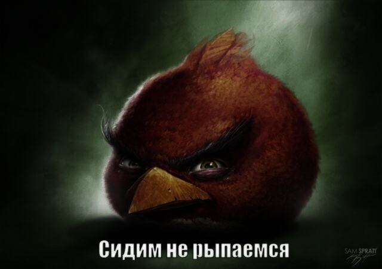
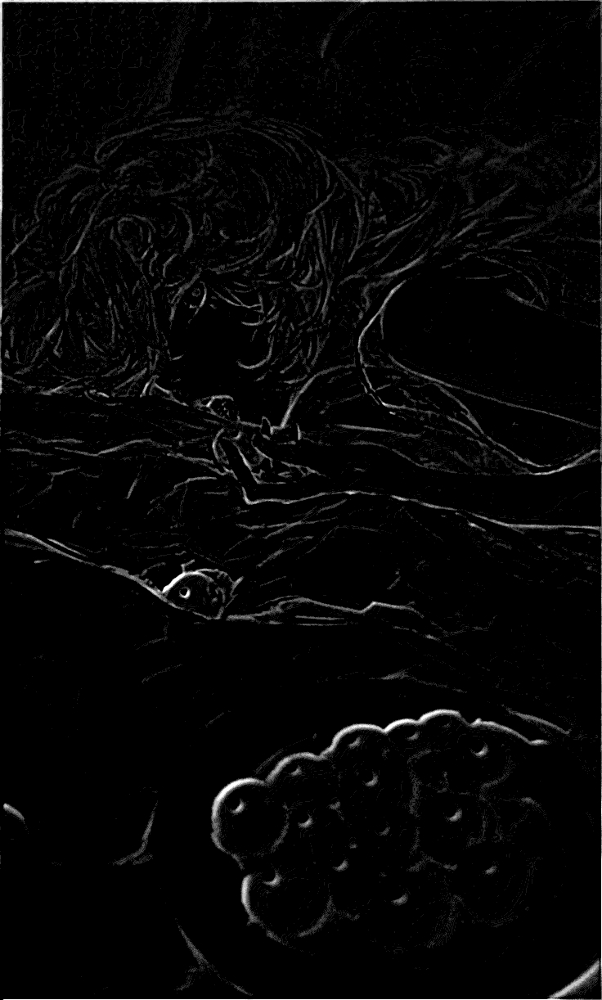

# Some tips in image processing with gaussian blur
(in pseudocode)

- ## Increase contrast:
`image * gaus_blur(grayscale(image))`  



- ## Detect edge (DoG method):
```
g1 = gaus_blur(image, size, stdev)
g2 = gaus_blur(image, size+sizediff, stdev + stdiff)
mod = (g2 - g1).normalize
return mod
```
  

The artifacts in the corner are caused by артивишал блят edge created by replacing non-existing pixels (pixels out of image) with solid color.
May consider using different method of out-of-image pixels interpolation.

For better effect, it is recommended to keep base convolution `size` at least 5-7 and `sizediff` 4-6. The bigger sizediff will better detect edges, but may lose information due to really small values before normalization.
`StDev` and `StDiff` determines both sensivity and lower&upper boundaries of detection. The bigger `StDiff` result in more noise. 

The image given in examples was processed by code (alg.cpp:algorytm):
```cpp
Image preprocess = gauss_blur(original, 13, 1); // to smooth artefacts of JPEG and prepare for image-detection

Image bw = to_grayscale(preprocess);

ColorRGBA missing_color(0.25,0.25,0.25); // out-of-image pixel values

int conv_size = 7;
int conv_size_diff = 5; // very important! without it, won't detect anything

double StBase = 1; // heavily determines the boundaries of resulting DoG
double StDiff = 0.95; // smaller -> sharper edges

Image g1 = gauss_blur(bw, conv_size, StBase, missing_color);
Image g2 = gauss_blur(bw, conv_size+conv_size_diff, StBase+StDiff, missing_color);

Image modified = g2 - g1;

ColorRGBA max_clr;
double k;

max_clr = get_color_at_int(modified, max(modified, to_gray));
k = to_gray(max_clr);
modified = (modified/k) * 2; // overflowing value > 1 to better highlight dark edges. later mapped to [0,255].

return modified;
```